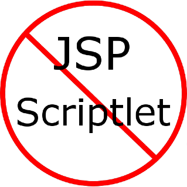

## Component Bindings Provider

### Write Maintainable Code &mdash; Banish Scriptlet!

Liberate yourself from Spaghetti Code!  The Component Bindings Provider API is designed to help separate logic from views and JSP scripts resulting in cleaner, more mantainable and more consise code.

Component Bindings Providers are OSGi Services called before a component script is executed allowing you to execute business logic, perform calculations or invoke other OSGi Services and make the results available to your component scripts, regardless of the scripting language you use.  

### Learn More

 * Learn how to [download and install the Component Bindings Provider](installation.html)
 * Learn how to [use the Component Bindings Provider](usage.html)
 * Read the [Javadocs for the Component Bindings Provider](api.html)
